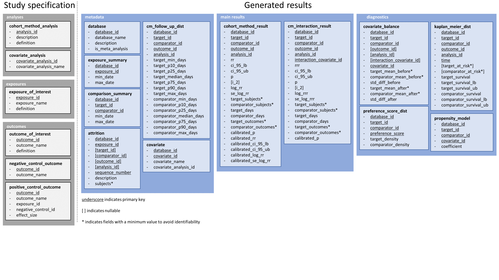

This document describes the data model for storing the output of the comparative effectiveness analyses. 

Fields with minimum values
==========================

Some fields contain patient counts or fractions that can easily be
converted to patient counts. To prevent identifiability, these fields
are subject to a minimum value. When the value falls below this minimum,
it is replaced with the negative value of the minimum. For example, if
the minimum subject count is 5, and the actual count is 2, the value
stored in the data model will be -5, which could be represented as '\<5'
to the user. Note that the value 0 is permissible, as it identifies no
persons.

These fields have been marked with \* in the preceding diagram, and are
noted 'with min value' in the Type column in the table definitions
below.

Study specification
===================

The first set of tables are not specific to a database, but rather
provide a reference for linking results generated in databases. These
can be thought of as the study specifications.

Analyses
--------

### Table: cohort_method_analysis

Lists the analyses that will be executed by the CohortMethod package.

| Field | Type | Description |
| ----- | ---- | ----------- |
| analysis_id | integer |  A unique identifier for an analysis. |
| description | varchar |  A description for an analysis, e.g. 'On-treatment'. |
| definition  | varchar |  A CohortMethod JSON object specifying the analysis. |

### Table: covariate_analysis

Lists the covariate analyses that will be executed by the
FeatureExtraction package. Each analysis can generate one or more covariates.
For example, the age group analysis creates binary covariates for each
5-year age group.

| Field | Type | Description |
| ----- | ---- | ----------- |
| analysis_id  | integer | A foreign key referencing the cohort_method_analysis table. |
| covariate_analysis_id | integer |  A unique identifier for a covariate analysis. |
| covariate_analysis_name             | varchar |  A name for a covariate analysis, e.g. 'Demographics: age group'. |

Exposures
---------

Exposures can be exposures to drugs, procedures, or combinations of
these. The exposure IDs used in the two exposure-of-interest tables do
not overlap.

### Table: exposure_of_interest

Lists all exposure cohorts considered in the study. 

| Field | Type | Description |
| ----- | ---- | ----------- |
| exposure_id   | integer | A unique identifier for an exposure. |
| exposure_name | varchar | A name for the exposure, e.g. 'Sertraline'. |
| definition    | varchar | ATLAS cohort definition JSON for constructing the exposure cohort. |

Outcomes
--------

Outcomes can be distinguished into outcomes of interest, where the true
effect size is unknown and of interest, negative control outcomes where
the true effect size is known to be 1, and positive control outcomes
where the true effect size is of a known magnitude greater than 1. The
outcome IDs used in the three outcome tables do not overlap.

### Table: outcome_of_interest

| Field | Type | Description |
| ----- | ---- | ----------- |
| outcome_id   | integer | A unique identifier for an outcome. |
| outcome_name | varchar | A name for the outcome, e.g. 'Stroke. |
| definition   | varchar | OHDSI SQL or JSON object defining the outcome. |

### Table: negative_control_outcomes

Negative control outcomes are derived from a single concept ID.

| Field | Type | Description |
| ----- | ---- | ----------- |
| outcome_id   | integer | A unique identifier for an outcome. |
| outcome_name | varchar | A name for the outcome, e.g. 'Ingrown nail'. |

### Table: positive_control_outcomes

Positive controls are synthesized by injecting simulated outcomes into
negative controls.

| Field | Type | Description |
| ----- | ---- | ----------- |
| outcome_id          | integer | A unique identifier for an outcome. |
| outcome_name        | varchar | A name for the outcome, e.g. 'Ingrown nail RR=2'. |
| exposure_id         | integer | The exposure for which the signal is injected. A foreign key referencing the exposure_of_interest table. |
| negative_control_id | integer | The negative control used to create the positive control. A foreign key referencing outcome_id field in the negative_control_outcomes table. |
| effect_size         | float   | The simulated effect size for the positive control. |

Generated results
=================

The second set of tables contain the results generated on each database.

Metadata
--------

For each database, some meta data is captured.

### Table: database

Lists the databases that have contributed data. To identify
meta-analyses estimates across databases, a dummy database record is
created where the is_meta_analysis flag is set to 1.

| Field | Type | Description |
| ----- | ---- | ----------- |
| database_id      | varchar | A unique identifier for a database, e.g. 'MDCD'. |
| database_name    | varchar | The full name for the database, e.g. 'Truven MarketScan Multi-state Medicaid (MDCD)'. |
| description      | varchar | A longer description, e.g. 'Truven Health MarketScan® Multi-State Medicaid Database (MDCD) adjudicated US health insurance claims for Medicaid enrollees from multiple states ...' |
| is_meta_analysis | integer | Does the record pertain a meta-analysis across databases? (0=no, 1=yes) |

### Table: exposure_summary

Provides summary statistics for the exposure cohorts, independent of
other exposure cohorts.

| Field | Type | Description |
| ----- | ---- | ----------- |
| database_id | varchar | Foreign key referencing the database. |
| exposure_id | integer | A foreign key referencing the exposure_of_interest table. |
| min_date    | date    | The earliest date when the exposure was observed in the database. |
| max_date    | date    | The latest date when the exposure was observed in the database. |

### Table: comparison_summary

Provides summary statistics for the comparison between two exposure
cohorts.

| Field | Type | Description |
| ----- | ---- | ----------- |
| database_id   | varchar | Foreign key referencing the database. |
| target_id     | integer | A foreign key referencing the exposure_of_interest table. |
| comparator_id | integer | A foreign key referencing the exposure_of_interest table. |
| min_date      | date    | The earliest date when both target and comparator were observed in the database. |
| max_date      | date    | The latest date when both target and comparator were observed in the database. |

### Table: attrition

Provides the number of people in the exposure cohorts after each step of
the analyses. Because some steps are related to a specific comparison or
even analysis, the target, comparator, and analysis ID can optionally
also be specified.

| Field | Type | Description |
| ----- | ---- | ----------- |
| database_id     | varchar                | Foreign key referencing the database. |
| exposure_id     | integer                | A foreign key referencing the exposure_of _interest table. |
| target_id       | integer nullable       | A foreign key referencing the exposure_of _interest table. |
| comparator_id   | integer nullable       | A foreign key referencing the exposure_of _interest table. |
| outcome_id      | integer nullable       | A foreign key referencing the outcome_of_interest table. |
| analysis_id     | integer nullable       | A foreign key referencing the cohort_method_analysis table. |
| sequence_number | integer                | The place in the sequence of steps defining the final analysis cohort. 1 indicates the  original exposed population without any inclusion criteria. |
| description     | varchar                | A description of the last restriction, e.g. "Removing persons with the outcome prior". |
| subjects        | integer with min value | The number of subjects in the cohort. |

### Table: covariate

Lists the covariates constructed in a database.

| Field | Type | Description |
| ----- | ---- | ----------- |
| database_id           | varchar | Foreign key referencing the database. |
| analysis_id           | integer | A foreign key referencing the cohort_method_analysis table. |
| covariate_id          | integer | A unique identified for a covariate. |
| covariate_name        | varchar | A name for a covariate, e.g. 'Age group: 20-25 years'. |
| covariate_analysis_id | integer | A foreign key referencing the covariate_analysis table. |

### Table: cm_follow_up_dist

Contains the distribution of follow up time in the target and comparator
groups for a specific cohort method analysis. Only outcomes of interest
are included.

| Field | Type | Description |
| ----- | ---- | ----------- |
| database_id            | varchar | Foreign key referencing the database. |
| target_id              | integer | A foreign key referencing the exposure_of_interest table. |
| comparator_id          | integer | A foreign key referencing the exposure_of_interest table. |
| outcome_id             | integer | A foreign key referencing the outcomes_of_interest, negative_control_outcome, or positive_control_outcome table. |
| analysis_id            | integer | A foreign key referencing the cohort_method_analysis table. |
| target_min_days        | integer | The minimum number of observation days for a person. |
| target_p10_days        | integer | The 10^th^ percentile of number of observation days for a person in the target group. |
| target_p25_days        | integer | The 25^th^ percentile of number of observation days for a person in the target group. |
| target_median_days     | integer | The median number of observation days for a person in the target group. |
| target_p75_days        | integer | The 75^th^ percentile of number of observation days for a person in the target group. |
| target_p90_days        | integer | The 90^th^ percentile of number of observation days for a person in the target group. |
| target_max_days        | integer | The maximum number of observation days for a person in the target group. |
| comparator_min_days    | integer | The minimum number of observation days for a person in the comparator group. |
| comparator_p10_days    | integer | The 10^th^ percentile of number of observation days for a person in the comparator group. |
| comparator_p25_days    | integer | The 25^th^ percentile of number of observation days for a person in the comparator group. |
| comparator_median_days | integer | The median number of observation days for a person in the comparator group. |
| comparator_p75_days    | integer | The 75^th^ percentile of number of observation days for a person in the comparator group. |
| comparator_p90_days    | integer | The 90^th^ percentile of number of observation days for a person in the comparator group. |
| comparator_max_days    | integer | The maximum number of observation days for a person in the comparator group. |

Main results
------------

These tables contain the main results.

### Table: cohort_method_results

Contains the results produced by the CohortMethod package for the main
effects. Also contains calibrated p-values and confidence intervals.
Meta-analysis estimates are also stored in this table.

| Field | Type | Description |
| ----- | ---- | ----------- |
| database_id          | varchar                | Foreign key referencing the database. |
| target_id            | integer                | A foreign key referencing the exposure_of_interest table. |
| comparator_id        | integer                | A foreign key referencing the exposure_of_interest table. |
| outcome_id           | integer                | A foreign key referencing the outcomes_of_interest, negative_control_outcome, or positive_control_outcome table. |
| analysis_id          | integer                | A foreign key referencing the cohort_method_analysis table. |
| rr                   | float                  | The estimated relative risk (hazard ratio). |
| ci_95_lb             | float                  | The lower bound of the 95% confidence interval of the relative risk. |
| ci_95_ub             | float                  | The upper bound of the 95% confidence interval of the relative risk. |
| p                    | float                  | The two-sided p-value considering the null hypothesis of no effect. |
| i_2                  | float nullable         | The I^2^ measure of between-database heterogeneity (for meta-analyses estimates only). |
| log_rr               | float                  | The log of the relative risk. |
| se_log_rr            | float                  | The standard error of the log of the relative risk. |
| target_subjects      | integer with min value | The number of subject in the target cohort. |
| comparator_subjects  | integer with min value | The number of subject in the comparator cohort. |
| target_days          | integer                | The number of days observed in the target cohort. |
| comparator_days      | integer                | The number of days observed in the comparator cohort. |
| target_outcomes      | integer with min value | The number of outcomes observed in the target cohort. |
| comparator_outcomes  | integer with min value | The number of outcomes observed in the comparator cohort. |
| calibrated_p         | float                  | The calibrated p-value. |
| calibrated_rr        | float                  | The calibrated relative risk (hazard ratio). |
| calibrated_ci_95_lb  | float                  | The lower bound of the calibrated 95% confidence interval of the relative risk. |
| calibrated_ci_95_ub  | float                  | The upper bound of the calibrated 95% confidence interval of the relative risk. |
| calibrated_log_rr    | float                  | The log of the calibrated relative risk. |
| calibrated_se_log_rr | float                  | The standard error of the log of the calibrated relative risk. |

### Table: cm_interaction_results

Contains the results produced by the CohortMethod package for the
interaction effects. Also contains calibrated p-values. Meta-analysis
estimates are also stored in this table.

| Field | Type | Description |
| ----- | ---- | ----------- |
| database_id              | varchar                | Foreign key referencing the database table. |
| target_id                | integer                | A foreign key referencing the exposure_of_interest table. |
| comparator_id            | integer                | A foreign key referencing the exposure_of_interest table. |
| outcome_id               | integer                | A foreign key referencing the outcomes_of_interest, negative_control_outcome, or positive_control_outcome table. |
| analysis_id              | integer                | A foreign key referencing the cohort_method_analysis table. |
| interaction_covariate_id | integer                | The covariate for which the interaction with the treatment variable was estimated. A foreign key referencing the covariate table. |
| rrr                      | float                  | The estimated relative risk ratio (hazard ratio ratio). |
| ci_95_lb                 | float                  | The lower bound of the 95% confidence interval of the relative risk ratio. |
| ci_95_ub                 | float                  | The upper bound of the 95% confidence interval of the relative risk ratio. |
| p                        | float                  | The two-sided p-value considering the null hypothesis of no effect. |
| i_2                      | float nullable         | The I^2^ measure of between-database heterogeneity (for meta-analyses estimates only). |
| log_rrr                  | float                  | The log of the relative risk ratio. |
| se_log_rrr               | float                  | The standard error of the log of the relative risk ratio. |
| target_subjects          | integer with min value | The number of subject in the target cohort having the covariate. |
| comparator_subjects      | integer with min value | The number of subject in the comparator cohort having the covariate. |
| target_days              | integer                | The number of days observed in the target cohort having the covariate. |
| comparator_days          | integer                | The number of days observed in the comparator cohort having the covariate. |
| target_outcomes          | integer with min value | The number of outcomes observed in the target cohort having the covariate. |
| comparator_outcomes      | integer with min value | The number of outcomes observed in the comparator cohort having the covariate. |
| calibrated_p             | float                  | The calibrated p-value. |

Diagnostics
-----------

### Table: covariate_balance

Contains the covariate balance statistics for each comparison. If the
interaction_covariate_id is specified, the results pertain to the
subgroup that has a non-zero value for that specific covariate. To save
space, balance for all covariates is only computed once for each
target-comparator pair, using propensity score matching and
stratification. Only a subset of covariates is reported for each
outcome-analysis combination.

| Field | Type | Description |
| ----- | ---- | ----------- |
| database_id              | varchar              | Foreign key referencing the database. |
| target_id                | integer              | A foreign key referencing the exposure_of_interest table. |
| comparator_id            | integer              | A foreign key referencing the exposure_of_interest table. |
| outcome_id               | integer nullable     | A foreign key referencing the outcomes_of_interest table. |
| analysis_id              | integer nullable     | A foreign key referencing the cohort_method_analysis table. |
| interaction_covariate_id | integer nullable     | For covariate balance within a subgroup: this covariate identifies the subgroup. A foreign key referencing the covariate table. |
| covariate_id             | integer              | A foreign key referencing the covariate table. |
| target_mean_before       | float with min value | The mean value of the covariate in the target cohort before propensity score adjustment. |
| comparator_mean_before   | float with min value | The mean value of the covariate in the comparator cohort before propensity score adjustment. |
| std_diff_before          | float                | The standardized difference of the means between the target and comparator cohort before propensity score adjustment. |
| target_mean_after        | float with min value | The mean value of the covariate in the target cohort after propensity score adjustment. |
| comparator_mean_after    | float with min value | The mean value of the covariate in the comparator cohort after propensity score adjustment. |
| std_diff_after           | float                | The standardized difference of the means between the target and comparator cohort after propensity score adjustment. |

### Table: preference_score_dist

Provides the preference score distribution for each comparison.

| Field | Type | Description |
| ----- | ---- | ----------- |
| database_id        | varchar | Foreign key referencing the database. |
| target_id          | integer | A foreign key referencing the exposure_of_interest table. |
| comparator_id      | integer | A foreign key referencing the exposure_of_interest table. |
| analysis_id        | integer | A foreign key referencing the cohort_method_analysis table. |
| preference_score   | float   | A preference score value. |
| target_density     | float   | The distribution density for the target cohort at the given preference score. |
| comparator_density | float   | The distribution density for the comparator cohort at the given preference score. |

### Table: kaplan_meier_dist

Contains data to display as a Kaplan-Meier plot for each comparison. The
number of subjects at risk in the target and comparator cohorts will
only be provided for specific pre-defined time points.

| Field | Type | Description |
| ----- | ---- | ----------- |
| database_id            | varchar                         | Foreign key referencing the database. |
| target_id              | integer                         | A foreign key referencing the exposure_of_interest table. |
| comparator_id          | integer                         | A foreign key referencing the exposure_of_interest table. |
| outcome_id             | integer                         | A foreign key referencing the outcomes_of_interest table. |
| analysis_id            | integer                         | A foreign key referencing the cohort_method_analysis table. |
| time                   | integer                         | Time in days since cohort start. |
| target_at_risk         | integer with min value nullable | The number of subjects still at risk in the target cohort. |
| comparator_at_risk     | integer with min value nullable | The number of subjects still at risk in the comparator cohort. |
| target_survival        | float                           | The estimated survival fraction in the target cohort. |
| target_survival_lb     | float                           | The lower bound of the 95% confidence interval of the survival fraction in the target cohort. |
| target_survival_ub     | float                           | The upper bound of the 95% confidence interval of the survival fraction in the target cohort. |
| comparator_survival    | float                           | The estimated survival fraction in the comparator cohort. |
| comparator_survival_lb | float                           | The lower bound of the 95% confidence interval of the survival fraction in the comparator cohort. |
| comparator_survival_ub | float                           | The upper bound of the 95% confidence interval of the survival fraction in the comparator cohort. |

### Table: propensity_model

Contains the propensity models.

| Field | Type | Description |
| ----- | ---- | ----------- |
| database_id   | varchar | Foreign key referencing the database. |
| target_id     | integer | A foreign key referencing the exposure_of_interest table. |
| comparator_id | integer | A foreign key referencing the exposure_of_interest table. |
| analysis_id   | integer | A foreign key referencing the cohort_method_analysis table. |
| covariate_id  | integer | A foreign key referencing the covariate table. |
| coefficient   | float   | The coefficient (beta) for the covariate in the propensity model. |
